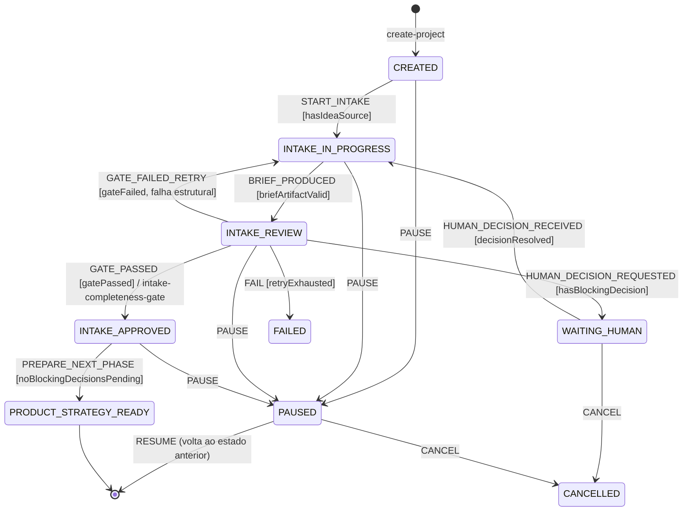

# Máquina de estados (fatia 1)

Fonte: `runtime/lib/state-machine.mjs`. Transições inválidas são recusadas com `INVALID_TRANSITION`
sem mutação de estado. Estados terminais (`FAILED`, `CANCELLED`) recusam qualquer evento.

## Semântica

- **Guards** são funções nomeadas registradas no histórico (`state-history.jsonl`) com evento,
  origem, destino, guard, gate e resumo de contexto — auditoria completa por projeto.
- **Gate:** `GATE_PASSED` só transita com resultado `pass`/`pass_with_warnings` do
  `intake-completeness-gate`; o id do GateResult é gravado no registro da transição.
- **Erro:** estratégia por transição (`reject` = recusa; `retry` = tentativa limitada pelo engine,
  `max_attempts: 2`). Falha estrutural com retry esgotado → `FAIL` → `FAILED` (stop-and-record).
- **Pausa/retomada:** `PAUSE` guarda `previous_state`; `RESUME` retorna a ele. `WAITING_HUMAN`
  pausa **apenas o fluxo afetado** (o pedido registra `blocked_scope` com o que segue liberado).
- **Cancelamento:** humano, de qualquer estado não terminal; nada é apagado.
- **Mapeamento para o pipeline do pipe:** os estados da fatia são subestados de `idea_intake`
  (enum `pipelineStage` do `ProductBaseline.schema.json`); `PRODUCT_STRATEGY_READY` entrega
  `next_action.pipe_pipeline_stage = founder_focus` (fase 2 de `execution/core-pipeline-map.md`).

## Persistência do estado

`project.json` com `state_version` (concorrência otimista: escrita exige versão esperada; conflito
→ `VERSION_CONFLICT`), escrita atômica tmp+rename, histórico em `state-history.jsonl` e eventos em
`events.jsonl` (ambos append-only).
